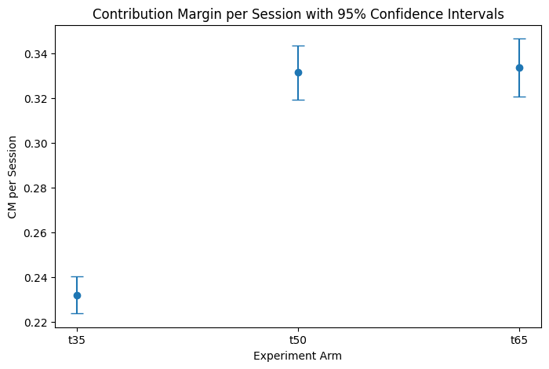

# Free Shipping Threshold Experiment

## Project Snapshot

| Item                  | Summary                                        |
| --------------------- | ---------------------------------------------- |
| Business Problem      | Determine optimal free-shipping threshold      |
| Experiment Type       | A/B/n experiment                               |
| Treatments            | $35, $50 (control), $65                        |
| Unit of Randomization | Session                                        |
| Primary Metric        | Contribution Margin per Session                |
| Diagnostics           | SRM test, traffic balance checks               |
| Key Finding           | $50 threshold maximizes profitability          |
| Tools Used            | Python, Pandas, SciPy, Statsmodels, Matplotlib |

---

# Business Question

What free-shipping threshold maximizes **contribution margin per session** while maintaining strong customer conversion?

E-commerce teams frequently adjust free-shipping thresholds to balance customer demand and shipping costs. Lower thresholds may increase conversion but reduce profitability due to higher shipping subsidies, while higher thresholds can increase average order value but reduce overall demand.

This project simulates and analyzes an A/B experiment to determine the optimal threshold.

---

# Executive Summary

### Experiment Setup

Customers were randomly assigned to one of three free-shipping thresholds:

| Treatment | Threshold                       |
| --------- | ------------------------------- |
| T35       | Free shipping at $35            |
| T50       | Free shipping at $50 (baseline) |
| T65       | Free shipping at $65            |

### Primary Metric

Contribution Margin per Session (CM / Session)

### Key Results

| Treatment | Conversion Rate | Avg Order Value | CM per Session |
| --------- | --------------- | --------------- | -------------- |
| T35       | 5.9%            | $48             | $2.85          |
| T50       | 5.1%            | $56             | $3.12          |
| T65       | 4.3%            | $63             | $2.94          |

### Recommendation

Maintain the **$50 free-shipping threshold**.

While the $35 threshold increases conversion, shipping subsidies reduce overall profitability.  
The $65 threshold increases order value but reduces demand too much to compensate.

The $50 threshold provides the best balance of conversion and profitability.

---

# Key Result

Below is the comparison of contribution margin per session across treatments.

---

# Experiment Design

### Unit of Randomization

Session-level randomization

### Treatments

Three thresholds tested:

- $35 free shipping
- $50 free shipping (control)
- $65 free shipping

### Hypotheses

Lower Threshold ($35)

- Conversion increases
- Average order value decreases
- Shipping subsidies increase
- Contribution margin may decline

Higher Threshold ($65)

- Conversion decreases
- Average order value increases
- Shipping subsidies decrease
- Net profitability uncertain

---

# Metrics

### Primary Metric

Contribution Margin per Session

Contribution Margin = Revenue − Product Cost − Shipping Cost

Why this metric?

Shipping promotions directly affect profitability. Measuring margin per session captures both demand changes and cost implications.

---

### Secondary Metrics

| Metric              | Purpose              |
| ------------------- | -------------------- |
| Conversion Rate     | Demand sensitivity   |
| Average Order Value | Basket size changes  |
| Revenue per Session | Top-line performance |
| Orders              | Volume impact        |

---

# Data Generation

This project uses **synthetic data** to simulate realistic e-commerce customer behavior.

Simulated features include:

- sessions
- conversion behavior
- order value
- shipping eligibility
- shipping cost
- product margin

Synthetic data allows the experiment analysis to be reproduced without using proprietary data.

---

# Diagnostics

Before estimating treatment effects, standard experiment diagnostics were performed.

### Sample Ratio Mismatch (SRM)

Chi-square test confirmed balanced traffic allocation.

| Check           | Result       |
| --------------- | ------------ |
| SRM             | Not detected |
| Traffic Balance | Passed       |

### Data Quality

Basic validation checks:

- no duplicate sessions
- non-negative revenue
- reasonable order values

---

# Analysis Methods

Treatment effects were evaluated using:

- mean comparison
- t-tests
- confidence intervals
- lift calculations

The analysis focuses on **practical business impact**, not just statistical significance.

---

# Future Improvements

Possible extensions:

- heterogeneous treatment effects by customer segment
- shipping elasticity modeling
- longer-term retention impact
- CUPED variance reduction
- Bayesian experiment analysis

---

# Author

Scott Belarmino  
Data Science Portfolio Project