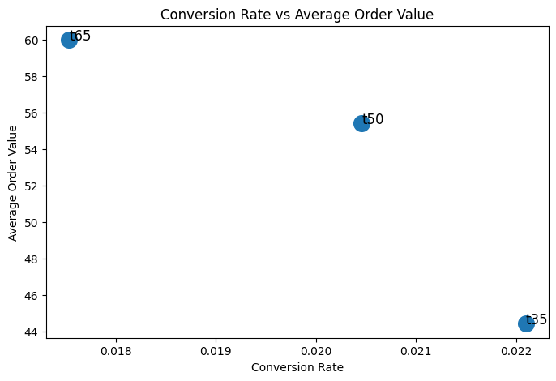

# E-Commerce Free Shipping Threshold Experiment

## TL;DR

Tested $35, $50, and $65 free-shipping thresholds using a full A/B/n experimentation framework.

**Result:** Keep the $50 threshold  
- $35 → increases conversion but significantly reduces profit  
- $65 → slightly improves margin but reduces conversion and revenue  
- $50 → best balance of conversion, basket size, and profitability  

---

## Overview

This project demonstrates an **end-to-end experimentation framework** to evaluate free-shipping thresholds for an ecommerce platform.

The goal is to identify the threshold that maximizes:

- **Contribution Margin per Session (primary metric)**
- while maintaining healthy conversion and shipping economics

The experiment simulates realistic customer behavior and applies production-style analysis:
- experiment design
- metric framework (primary / secondary / guardrails)
- diagnostics (SRM, data checks)
- statistical inference
- business decision making

---

## Key Result

| Threshold | Conversion | AOV | CM / Session |
| --------- | ---------- | --- | ------------ |
| $35       | 2.21%      | $44 | $0.232       |
| $50       | 2.05%      | $55 | $0.332       |
| $65       | 1.75%      | $60 | $0.334       |

**Decision:** Maintain the $50 threshold  

**Why:**
- $35 materially reduces profitability (high shipping subsidy)
- $65 provides negligible improvement (+0.002 CM/session, ~0.6%)
- $65 reduces conversion and revenue per session
- Difference between $50 and $65 is **not statistically significant**

---

## Business Context

Free-shipping thresholds create a tradeoff:

| Lower Threshold | Higher Threshold    |
| --------------- | ------------------- |
| ↑ Conversion    | ↑ Basket Size (AOV) |
| ↑ Shipping Cost | ↓ Conversion        |
| ↓ Profitability | ↓ Demand            |

The goal is to find the optimal balance.

---

## Experiment Design

- **Type:** A/B/n experiment  
- **Treatments:** $35, $50 (control), $65  
- **Unit of Randomization:** Session  
- **Duration:** ~45 days  
- **Sample Size:** ~150K sessions per arm  

---

## Metrics

### Primary Metric
- **Contribution Margin per Session**  
  Captures both demand and cost impact

### Secondary Metrics
- Conversion Rate  
- Average Order Value (AOV)  
- Revenue per Session  

### Guardrails
- Shipping Subsidy per Order  
- Negative Margin Order Rate  
- Revenue per Session  

---

## Methodology

The project follows a standard experimentation workflow:

1. Experiment design and hypothesis definition  
2. Synthetic data generation  
3. Diagnostics (SRM, data validation)  
4. Metric framework definition  
5. Primary metric evaluation  
6. Behavioral (mechanism) analysis  
7. Guardrail validation  
8. Statistical inference (t-tests, confidence intervals)  
9. Business decision  

---

## Power Analysis

The experiment was designed to detect:

- **MDE ≈ $0.025 CM per session (~9%)**
- **~150K sessions per arm**
- **~45-day runtime**

This corresponds to roughly:

- **~$90K annual business impact**

---

## Key Insight

The experiment confirms that:

> The current $50 threshold is already near optimal.

This is a common outcome in real-world experimentation:
- many tests validate existing policies rather than replace them

---

## Visualizations

**Primary Metric Comparison**  


**Conversion vs AOV Tradeoff**  


---

## Reproducing the Experiment

See full instructions below to regenerate synthetic data and rerun the analysis.

<details>
<summary>Click to expand</summary>

### 1. Clone the Repository

```bash
git clone <your-repo-url>
cd project_2_ab_testing
```

### 2. Setup Environment

```bash
python3 -m venv .venv
source .venv/bin/activate
pip install -r requirements.txt
```

### 3. Generate Data

```bash
jupyter notebook
```
Open/Run Generator:

```
notebooks/00_generate_free_shipping_experiment.ipynb  
```

### 4. Run Analysis

```bash
jupyter notebook
```

Open:

```
notebooks/02_experiment_analysis.ipynb
```

</details>

---

## Future Work

- Segment-specific thresholds (customer, category)
- Dynamic / personalized shipping incentives
- Basket completion nudges
- Bayesian experiment framework

---

## Author

Scott Belarmino  
Data Scientist | Decision Science | Causal Inference  

---

## Notes

This project was independently developed as part of a data science portfolio.  

Large Language Models (LLMs) were used to assist with code organization, documentation clarity, and readability. All modeling, analysis, and interpretations were designed and validated by the author.